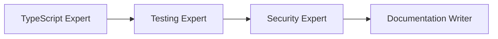
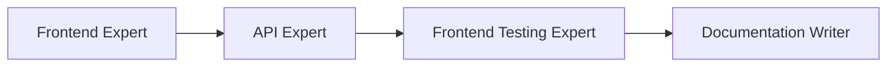
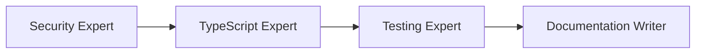
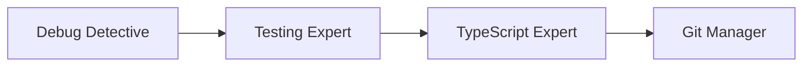
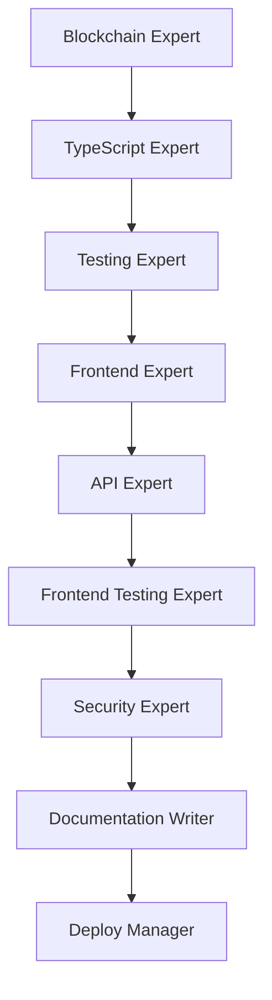

# AGENTS.md - Sistema de Agentes IA

**Proyecto:** Besu Network Manager
**Autor:** Javier Ruiz-Canela López
**Email:** jrcanelalopez@gmail.com
**Fecha:** 28 de Junio, 2025

---

## Introducción

Este documento describe el sistema de agentes especializados diseñados para el desarrollo y mantenimiento del proyecto **Besu Network Manager**. Cada agente tiene capacidades específicas y trabaja en conjunto con otros para completar tareas complejas.

## Agentes Disponibles

### 🏗️ Agentes de Construcción

| Agente | Archivo | Especialidad | Prioridad |
|--------|---------|--------------|-----------|
| **TypeScript Expert** | [typescript-expert.md](.claude/agents/typescript-expert.md) | Desarrollo de librería Besu | Alta |
| **Frontend Expert** | [frontend-expert.md](.claude/agents/frontend-expert.md) | Desarrollo Next.js/React | Alta |
| **Docker Expert** | [docker-expert.md](.claude/agents/docker-expert.md) | Gestión de contenedores Docker | Alta |
| **API Expert** | [api-expert.md](.claude/agents/api-expert.md) | REST API con Next.js | Media |

### 🧪 Agentes de Validación

| Agente | Archivo | Especialidad | Prioridad |
|--------|---------|--------------|-----------|
| **Testing Expert** | [testing-expert.md](.claude/agents/testing-expert.md) | Testing con Jest | Alta |
| **Security Expert** | [security-expert.md](.claude/agents/security-expert.md) | Seguridad y validaciones | Alta |
| **Frontend Testing Expert** | [frontend-testing-expert.md](.claude/agents/frontend-testing-expert.md) | Testing de UI/componentes | Media |

### 🚀 Agentes de Operaciones

| Agente | Archivo | Especialidad | Prioridad |
|--------|---------|--------------|-----------|
| **Deploy Manager** | [deploy-manager.md](.claude/agents/deploy-manager.md) | Despliegue y CI/CD | Media |
| **Documentation Writer** | [documentation-writer.md](.claude/agents/documentation-writer.md) | Documentación técnica | Alta |
| **Git Manager** | [git-manager.md](.claude/agents/git-manager.md) | Control de versiones | Baja |

### 🔧 Agentes Especializados

| Agente | Archivo | Especialidad | Prioridad |
|--------|---------|--------------|-----------|
| **Debug Detective** | [debug-detective.md](.claude/agents/debug-detective.md) | Debugging y resolución | Alta |
| **Blockchain Expert** | [blockchain-expert.md](.claude/agents/blockchain-expert.md) | Consenso y redes Besu | Alta |

## Cómo Usar los Agentes

### Sintaxis Básica

```
Usa el agente "[NOMBRE_AGENTE]" para [TAREA_ESPECÍFICA]
```

### Ejemplos por Agente

#### TypeScript Expert

```
Usa el agente "TypeScript Expert" para implementar la función addNode()
en BesuNetwork con todas las validaciones según CLAUDE.md
```

```
Usa el agente "TypeScript Expert" para refactorizar el método create()
separando la lógica de validación en funciones helper
```

#### Testing Expert

```
Usa el agente "Testing Expert" para escribir todos los tests
de la función updateNetworkConfig() incluyendo casos edge
```

```
Usa el agente "Testing Expert" para alcanzar 90% de cobertura
en el archivo create-besu-networks.ts
```

#### Frontend Expert

```
Usa el agente "Frontend Expert" para crear la página /networks/[id]/edit
responsive con Tailwind CSS y validación con Zod
```

```
Usa el agente "Frontend Expert" para implementar el componente NodeCard
que muestre estado del nodo (running/stopped) con indicadores visuales
```

#### Docker Expert

```
Usa el agente "Docker Expert" para optimizar la creación de redes Docker
y reducir conflictos de subnet
```

```
Usa el agente "Docker Expert" para implementar health checks
en los contenedores Besu
```

#### Debug Detective

```
Usa el agente "Debug Detective" para analizar por qué
el test testUpdateNetworkConfig está fallando
```

```
Usa el agente "Debug Detective" para investigar el error
"Cannot connect to Docker daemon" en tests
```

#### Blockchain Expert

```
Usa el agente "Blockchain Expert" para explicar las diferencias
entre consenso Clique e IBFT2 y cuándo usar cada uno
```

```
Usa el agente "Blockchain Expert" para implementar validación
de que cada miner tiene su signerAccount en consenso Clique
```

## Workflows Predefinidos

### Workflow 1: Nueva Función de Librería



**Pasos**:
1. **TypeScript Expert** → Implementa función con validaciones
2. **Testing Expert** → Escribe tests unitarios y de integración
3. **Security Expert** → Revisa validaciones y casos edge
4. **Documentation Writer** → Documenta API y ejemplos

**Ejemplo**:
```
Workflow "Nueva Función de Librería" para implementar
la función removeMultipleNodes() que permita remover
varios nodos a la vez de una red existente
```

### Workflow 2: Nueva Página del Frontend



**Pasos**:
1. **Frontend Expert** → Crea página y componentes
2. **API Expert** → Implementa endpoints REST necesarios
3. **Frontend Testing Expert** → Escribe tests de componentes
4. **Documentation Writer** → Documenta UI y API

**Ejemplo**:
```
Workflow "Nueva Página del Frontend" para crear
la página /networks/[id]/monitoring que muestre
métricas en tiempo real de los nodos
```

### Workflow 3: Nueva Validación de Seguridad



**Pasos**:
1. **Security Expert** → Identifica caso edge o vulnerabilidad
2. **TypeScript Expert** → Implementa validación
3. **Testing Expert** → Escribe tests de validación
4. **Documentation Writer** → Documenta en CLAUDE.md

**Ejemplo**:
```
Workflow "Nueva Validación de Seguridad" para prevenir
que se puedan crear nodos con IPs duplicadas en diferentes redes
```

### Workflow 4: Debugging Completo



**Pasos**:
1. **Debug Detective** → Identifica root cause
2. **Testing Expert** → Crea test reproduciendo bug
3. **TypeScript Expert** → Implementa fix
4. **Git Manager** → Crea commit descriptivo

**Ejemplo**:
```
Workflow "Debugging Completo" para resolver el error
"Network not found" que aparece intermitentemente
al llamar a getNetworkInfo()
```

### Workflow 5: Feature Completa (End-to-End)



**Pasos**:
1. **Blockchain Expert** → Diseña feature con conceptos blockchain
2. **TypeScript Expert** → Implementa en librería
3. **Testing Expert** → Tests de librería
4. **Frontend Expert** → UI para feature
5. **API Expert** → Endpoints REST
6. **Frontend Testing Expert** → Tests de UI
7. **Security Expert** → Auditoría completa
8. **Documentation Writer** → Documentación completa
9. **Deploy Manager** → Preparar deployment

**Ejemplo**:
```
Workflow "Feature Completa" para implementar soporte
de consenso QBFT con interfaz web para configurarlo
```

## Estructura de Cada Agente

Cada archivo de agente sigue esta estructura:

```markdown
# [Nombre del Agente]

## Rol
Descripción concisa del rol principal

## Especialidad
Tecnologías y áreas específicas

## Capacidades
- Lista de capacidades específicas
- Operaciones que puede realizar
- Herramientas que domina

## Prompt del Sistema
Instrucciones detalladas para el agente con:
- Contexto del proyecto
- Principios a seguir
- Patrones de código
- Ejemplos específicos

## Ejemplos de Uso
Casos de uso concretos con sintaxis

## Limitaciones
Qué NO debe hacer y cuándo delegar

## Integración con Otros Agentes
Con qué agentes trabaja mejor

## Outputs Esperados
Qué debe proporcionar al completar
```

## Agentes por Caso de Uso

### Desarrollo de Librería

**Agentes principales**:
- TypeScript Expert
- Testing Expert
- Docker Expert
- Blockchain Expert

**Workflow típico**:
```
1. Blockchain Expert diseña funcionalidad
2. TypeScript Expert implementa
3. Docker Expert valida operaciones Docker
4. Testing Expert escribe tests
```

### Desarrollo de Frontend

**Agentes principales**:
- Frontend Expert
- API Expert
- Frontend Testing Expert

**Workflow típico**:
```
1. Frontend Expert crea UI
2. API Expert implementa endpoints
3. Frontend Testing Expert escribe tests
```

### Debugging

**Agentes principales**:
- Debug Detective
- Testing Expert
- Docker Expert (si involucra Docker)

**Workflow típico**:
```
1. Debug Detective analiza error
2. Testing Expert crea test reproduciendo bug
3. [Agente relevante] implementa fix
```

### Documentación

**Agentes principales**:
- Documentation Writer
- TypeScript Expert (para API docs)
- Frontend Expert (para UI docs)

**Workflow típico**:
```
1. Documentation Writer estructura documentación
2. Expertos técnicos proveen detalles
3. Documentation Writer integra y formatea
```

## Métricas y Tracking

El uso de agentes se puede trackear en:
- `.claude/usage-log.json` - Log de cada uso (si existe)
- `.claude/metrics.json` - Estadísticas agregadas (si existe)

## Añadir Nuevos Agentes

Para crear un nuevo agente especializado:

1. **Crear archivo** en `.claude/agents/nuevo-agente.md`
2. **Seguir estructura** estándar (ver arriba)
3. **Añadir a AGENTS.md** en tabla correspondiente
4. **Documentar integraciones** con otros agentes existentes
5. **Crear ejemplos** de uso específicos del proyecto

### Plantilla para Nuevo Agente

```markdown
# [Nombre del Agente]

## Rol
[Descripción del rol]

## Especialidad
[Tecnologías/áreas específicas]

## Capacidades
- Capacidad 1
- Capacidad 2
- Capacidad 3

## Prompt del Sistema
[Instrucciones detalladas]

### Contexto del Proyecto
[Específico para Besu Network Manager]

### Principios
1. Principio 1
2. Principio 2

### Patrones de Código
```typescript
// Ejemplos
```

## Ejemplos de Uso
### Ejemplo 1
\`\`\`
Usa el agente "[Nombre]" para [tarea]
\`\`\`

## Limitaciones
### No hacer
- ❌ Limitación 1
- ❌ Limitación 2

### Delegar a otros agentes
- **Agente X**: Para [qué]

## Integración con Otros Agentes
### Workflow Típico
1. Este agente → hace X
2. Agente Y → hace Y

## Outputs Esperados
1. Output 1
2. Output 2

---
**Agente**: [Nombre] v1.0
**Proyecto**: Besu Network Manager
```

## Prioridad de Agentes

### Alta Prioridad (Uso frecuente)
- TypeScript Expert
- Testing Expert
- Frontend Expert
- Docker Expert
- Debug Detective
- Documentation Writer
- Blockchain Expert
- Security Expert

### Media Prioridad (Uso ocasional)
- API Expert
- Frontend Testing Expert
- Deploy Manager

### Baja Prioridad (Uso específico)
- Git Manager

## Comandos Relacionados

Ver disponibles en `.claude/commands/`:

### Besu Library
- `/test-lib` - Ejecutar tests de librería
- `/example-simple` - Ejecutar ejemplo simple
- `/example-advanced` - Ejecutar ejemplo avanzado
- `/cleanup-networks` - Limpiar redes Docker

### Frontend
- `/dev-frontend` - Iniciar dev server
- `/build-frontend` - Build de producción
- `/test-frontend` - Tests de frontend

### Docker
- `/docker-status` - Estado de contenedores
- `/docker-logs` - Ver logs de nodos
- `/docker-cleanup` - Limpiar recursos Docker

## Ver También

- [CLAUDE.md](./CLAUDE.md) - Especificaciones técnicas del proyecto
- [README.md](./README.md) - Documentación general del proyecto
- [lib/README.md](./lib/README.md) - Documentación de librería
- [app/README.md](./app/README.md) - Documentación de aplicación

## Contacto

**Desarrollador**: Javier Ruiz-Canela López
**Email**: jrcanelalopez@gmail.com

---

**Total de Agentes**: 12
**Última actualización**: 28 de Junio, 2025
**Versión**: 1.0
**Proyecto**: Besu Network Manager
